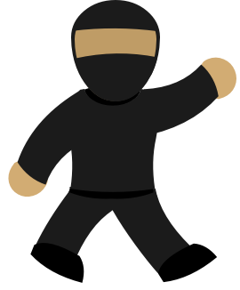

# Kasia Rivers - Portfolio

## CraveFree

CraveFree is a project designed to support individuals struggling with nicotine addiction by providing a simple yet effective tool to track cravings and offer encouragement on their journey.

I worked on this project with team, on which I served as the lead developer. I will be returning to this project to improve its functionality and add interactivity to the widget.

    

> [!NOTE]
> View more about this project and clone the repository .

## iOS Game - Personal Project

  

This is a 2D arcade-style video game I developed using SpriteKit. This is a project I worked on as part of a challenge to learn something I was excited about. I love video games so I was excited to learn how to make one. This project was a lot of fun and taught me a lot about the fundamentals of SpriteKit and Swift in general, was a great opportunity to skill up.

I plan to continuously return to this project over time to add features and practice using SpriteKit and GameplayKit in new ways. 

> [!NOTE]
> View more about this project and clone the repository .

