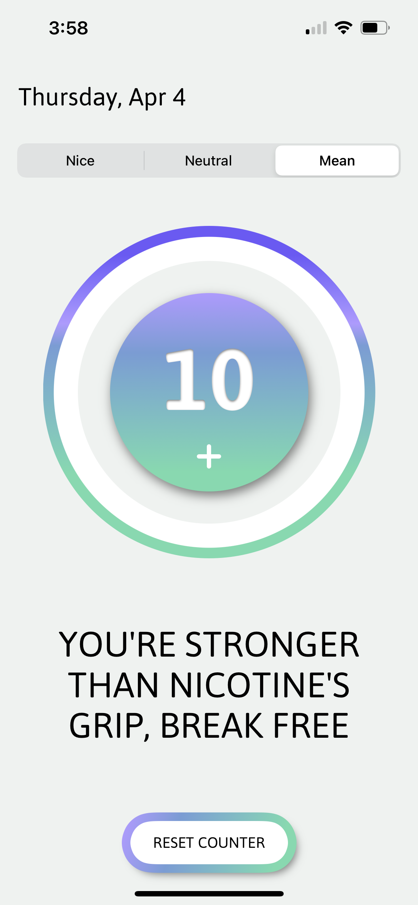

# Kasia Rivers - Portfolio

## CraveFree

    

CraveFree is a project designed to support individuals struggling with nicotine addiction by providing a simple yet effective tool to track cravings and offer encouragement on their journey.

I worked on this project with team, on which I served as the lead developer. I will be returning to this project to improve its functionality and add interactivity to the widget.

View more about this project and clone the repository .

## iOS Game - Personal Project
